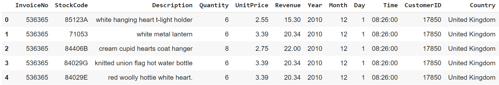
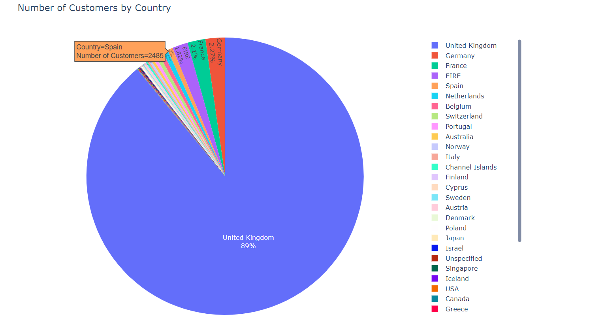
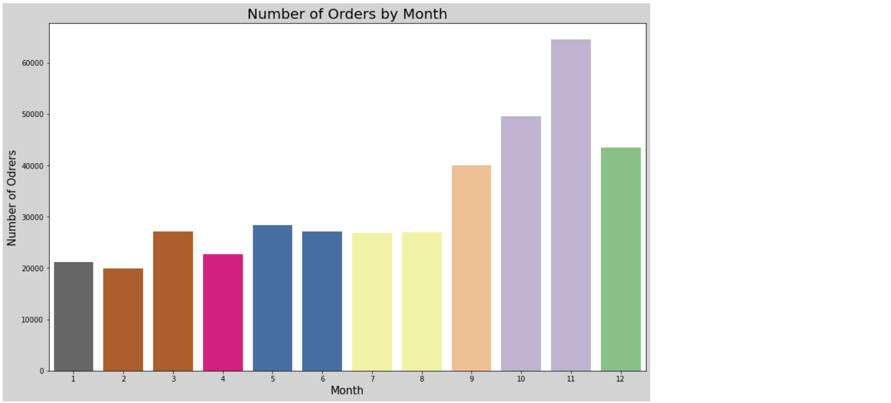
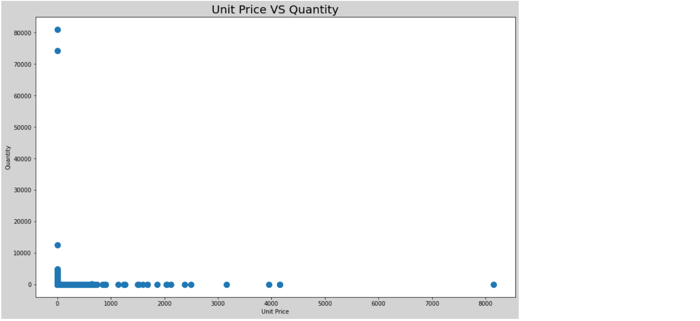

# Final-Project
## Online Retail Data Analysis

In this notebook, I will use a transnational [dataset](https://www.kaggle.com/carrie1/ecommerce-data) that contains all the transactions occurring between 01-12-2010 and 09-12-2011 for a UK-based and registered non-store online retail. The company mainly sells unique all-occasion gifts. Many customers of the company are wholesalers.

I am going to:
1.   Explore, clean, and prepare the data using EDA
2.   Visualize the data using Plotly, Matplotlib, and Seaborn to have the answers to some business questions
3.   Classify the customers based on their buying behavior using K-Means clustering

### Dataset Description

The dataset contains fields that describe each unit ordered such as:
* Invoice number 
* Stock code
* Description of the order
* Quantity ordered
* Price of each unit
* Invoice date
* Customer ID
* Country

### Exploratory Data Analysis (EDA)

In this section, I prepared the data to be ready for the next steps. 

* First: I removed the missing (null) values and some unreasonable negative values in the Quantity Column.

* Second: I modified the data types of the columns and added a new column that shows the revenue (Quantity x UnitPrice).

This is the cleaned dataset:

### Data Visualization 

Here I got the answers to some business questions:
1. How many customers do we have in each country?

As the graph shows, there is 89% of the customers from UK, 2.27% from Germany, and 2.1% from France. There are also too many other countries but the number of customers is very low. The company now can try to adopt new marketing and advertising strategies to increase the number of its customers in these countries.

2. How many orders do we receive per day and per month?

The graph shows that the number of orders is fluctuating throughout the month. However, we can notice that it decreases at the end of the month.

Based on the graph, the company receives many orders in the last 4 months of the year. However, it receives less in the other months. One way to increase the sales is to focus on these months where the number of orders are lower and try to increase the sales. Also, look for the reason for the increase in the number of orders in the last 4 months to exploit the opportunity of receiving much more orders by using some strategies.

3. What is the relationship between the number of units sold and the unit price?

You can see a strong negative nonlinear relationship between the quantity of the units and the price of each unit. If the quantity increases the unit price decreases and vice versa. 

#### Customer Classification Using K-Means Clustring

The company needs to classify its customers into different segments formed on some features. This will help the company to better deal with them differently in a way it can gain their satisfaction. 

Here I classified the customers based on their buying behavior. I specified the quantity of units sold and the revenue from each unit as the features of the classification. Then I used K-Means Clustering to create four clusters of customers based on the purchasing behavior.

The figure shows four segments of the customers based on the way they purchase using the features of the quantity purchased and the revenue.

