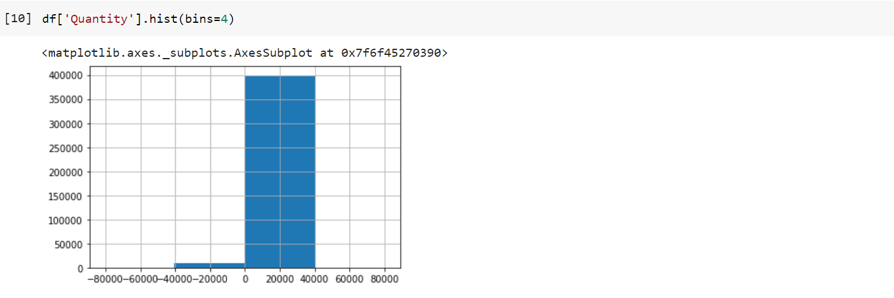

# Final-Project
## Online Retail Data Analysis

In this notebook, I will use a transnational [dataset](https://www.kaggle.com/carrie1/ecommerce-data) that contains all the transactions occurring between 01-12-2010 and 09-12-2011 for a UK-based and registered non-store online retail. The company mainly sells unique all-occasion gifts. Many customers of the company are wholesalers.

I am going to:
1.   Explore, clean, and prepare the data using EDA
2.   Visualize the data using Plotly, Matplotlib, and Seaborn to have the answers to some business questions
3.   Classify the customers based on their buying behavior using K-Means clustering

### Dataset Description

The dataset contains fields that describe each unit ordered such as:
* Invoice number 
* Stock code
* Description of the order
* Quantity ordered
* Price of each unit
* Invoice date
* Customer ID
* Country

### Exploratory Data Analysis (EDA)

In this section I prepared the data to be ready for the next steps. 

First I removed the missing (null) values and some unreasonable negative values in the Quantity Column.

